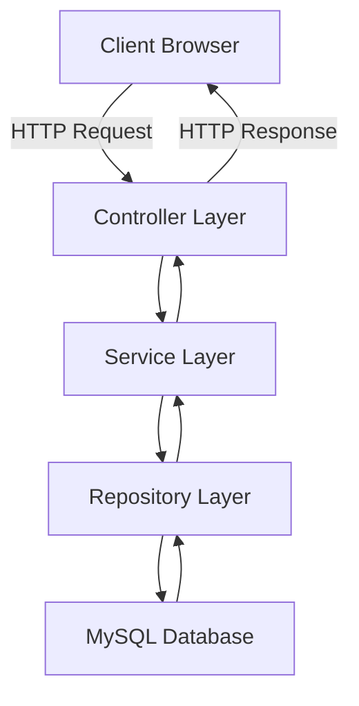
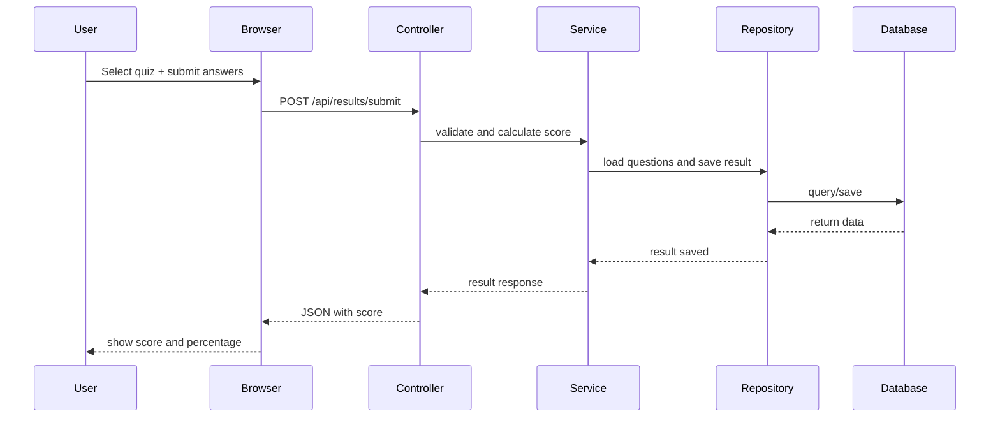
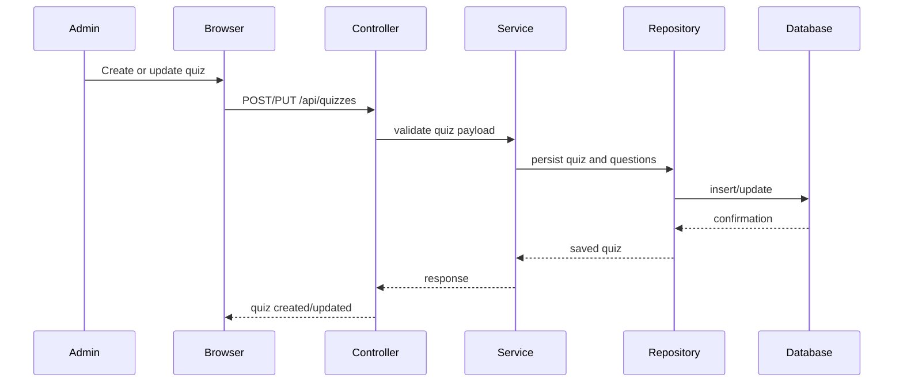

# Online Quiz System Project Report

## 1. Introduction and Objectives

This project implements an Online Quiz System using Java, Spring Boot, Spring MVC, Spring Data JPA, and MySQL. The objective is to build a full-stack quiz application that supports user registration and login, quiz creation and management, quiz participation, answer submission, score calculation, and result history.

Key goals:
- Provide a user-friendly interface for quiz takers and admin users.
- Manage quiz data with a relational database using Spring Data JPA.
- Use REST API endpoints to separate frontend and backend responsibilities.
- Secure user passwords with BCrypt hashing.
- Demonstrate a clean MVC architecture with controllers, services, repositories, and DTOs.

## 2. Tools and Technologies Used

- Java 17
- Spring Boot 3.3.5
- Spring MVC
- Spring Data JPA
- Spring Security Crypto (BCrypt password hashing)
- MySQL database
- Maven for dependency management and build
- Thymeleaf and static HTML/CSS/JavaScript for the frontend
- Lombok for boilerplate reduction (optional)

## 3. System Architecture

The system follows a layered MVC architecture:

- **Model**: JPA entity classes represent database tables.
- **Repository**: Spring Data JPA repositories handle database access.
- **Service**: Business logic is implemented in service classes.
- **Controller**: REST controllers receive HTTP requests and return JSON responses.
- **View**: Static HTML pages and JavaScript files provide the frontend experience.

### Architecture Diagram



### Components

- `UserController`: Handles registration and login.
- `QuizController`: Handles quiz creation, retrieval, update, and deletion.
- `ResultController`: Handles quiz submission and result retrieval.
- `AdminController`: Manages administrative pages.
- `QuizService`, `ResultService`, `UserService`: Implement business rules.
- Repositories: `UserRepository`, `QuizRepository`, `QuestionRepository`, `ResultRepository`, `AttemptAnswerRepository`.

## 4. Workflow Diagrams

### User Quiz Flow



### Admin Quiz Management Flow



## 5. Implementation Details

### Project Structure

The project is structured as follows:

- `src/main/java/com/example/quizsystem`
  - `config`: Application beans, such as password encoder configuration.
  - `controller`: REST controllers for users, quizzes, results, and admin operations.
  - `dto`: Data transfer objects for request and response payloads.
  - `exception`: Custom exceptions and global exception handling.
  - `model`: JPA entity models for `User`, `Quiz`, `Question`, `Result`, and `AttemptAnswer`.
  - `repository`: Spring Data JPA repositories for persistence.
  - `service`: Service layer for business logic.
- `src/main/resources`
  - `application.properties`: Database and Spring Boot configuration.
  - `static`: Frontend HTML, CSS, JavaScript pages for login, dashboard, quiz, and admin.
  - `data.sql` and `schema.sql`: Optional startup data and schema scripts.

### Backend Implementation

- `QuizSystemApplication.java` is the Spring Boot entry point.
- `AppConfig.java` defines the `PasswordEncoder` bean for BCrypt hashing.
- DTOs like `RegisterRequest`, `LoginRequest`, `QuizRequest`, and `SubmitQuizRequest` define request payloads.
- Controllers map REST endpoints under `/api/*`.
- Services encapsulate operations such as registering users, creating quizzes, calculating results, and retrieving history.
- Repositories use Spring Data JPA to simplify CRUD operations and query methods.
- `GlobalExceptionHandler` converts exceptions into consistent JSON error responses.

### Database and Persistence

- Connected to MySQL via `spring.datasource.url`.
- Hibernate auto-creates or updates tables based on JPA entities.
- Entities use relationships between `Quiz`, `Question`, `Result`, and `AttemptAnswer` to store quizzes and answers.
- Passwords are stored securely using BCrypt.

### Frontend Pages

The static frontend includes:

- `index.html`: Landing page.
- `login.html`: User login page.
- `dashboard.html`: User dashboard showing available quizzes.
- `quiz.html`: Quiz-taking page.
- `result.html`: Result display page.
- `admin-login.html` and `admin.html`: Admin login and management dashboard.
- `app.js`: JavaScript logic for the frontend to call backend APIs.
- `styles.css`: Styling for the user interface.

## 6. Screenshots

> Note: These placeholders describe the screenshots that should be included when submitting a final report. Actual images are not embedded here.

1. Login page screenshot: `src/main/resources/static/login.html`
2. Dashboard showing quiz list: `src/main/resources/static/dashboard.html`
3. Quiz question view: `src/main/resources/static/quiz.html`
4. Result page with score: `src/main/resources/static/result.html`
5. Admin quiz management panel: `src/main/resources/static/admin.html`

## 7. Results and Observations

- The application supports end-to-end quiz functionality from registration to result history.
- Users can register, log in, attempt quizzes, and view results immediately.
- Admin-side quiz creation and management are available through REST API calls and admin pages.
- The layered architecture keeps the code maintainable and easy to extend.
- Password hashing adds a security layer, while Spring Data JPA simplifies persistence.

## 8. Conclusion

This Online Quiz System project successfully demonstrates a complete Java Spring Boot application with database integration, RESTful APIs, user authentication, and dynamic quiz handling. The MVC architecture and service-oriented design provide a clean separation of concerns, making the system suitable for future enhancements such as role-based access, full authentication with Spring Security, and richer quiz analytics.

---

### Appendix: Running the Application

1. Create the MySQL database:

```sql
CREATE DATABASE quiz_system;
```

2. Update `src/main/resources/application.properties` with your MySQL credentials.
3. Run the app:

```bash
mvn spring-boot:run
```

4. Access the application at `http://localhost:8080`.
